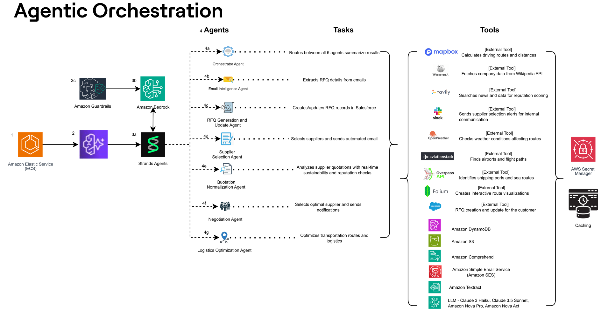
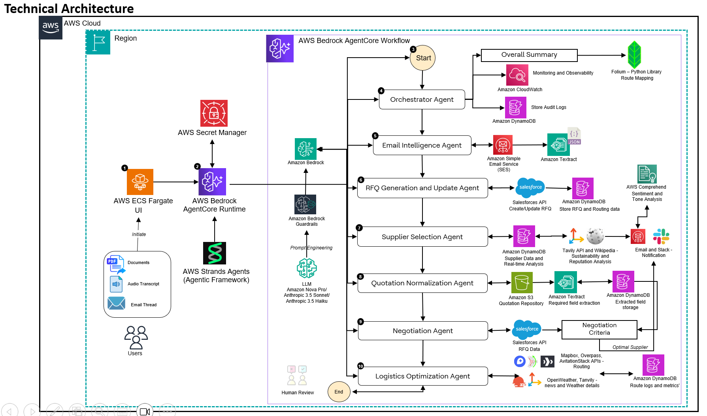

# Project Workflow — RFQ → Award → Logistics (Agentic Runbook)

This document explains **how the system runs end‑to‑end**, the operational steps, configs, and artifacts produced—aligned to the real supply‑chain use case (not Git branching).



## 0) Prereqs
- Python 3.10+, AWS credentials configured (for Bedrock, DynamoDB, SES, S3/Textract).
- External services as needed: Salesforce, Gmail API, Slack, Mapbox.
- `cp .env.example .env` and populate credentials/IDs; run `python test_env_setup.py`.

## 1) Modes of operation
- **Local demo** (single‑process, prints summary):  
  ```bash
  python supply-chain-master-agent.py
  ```
- **AgentCore Runtime** (HTTP entrypoint for hosting/containers):  
  ```bash
  LOCAL_TEST=1 python master-agent-runtime-entrypoint.py
  ```
  The entrypoint validates payloads, invokes the **Supervisor**, and returns a JSON result.

## 2) End‑to‑end workflow (what happens during a run)
1. **A0 – Email Intelligence (Haiku):** fetch Gmail threads + attachments; extract RFQ fields → RFQ JSON.  
2. **A1 – RFQ Update (Haiku):** upsert RFQ/Account in **Salesforce**; seed **DynamoDB** `supply_rfqs`.  
3. **A2 – Supplier Selection (Haiku/Sonnet):** shortlist suppliers, draft/send RFQs via **SES**; capture replies.  
4. **A3 – Quote Normalization (Sonnet):** Textract/LLM → comparable schema; enrich with market/wiki signals.  
5. **A4 – Negotiation (Sonnet):** multi‑criteria scoring; counter‑offer/award email; **Slack** notification; persist to `supply_bids`.  
6. **A5 – Logistics (Sonnet):** compute **ALL_OCEAN vs SPLIT_AIR_OCEAN** with cost/ETA/CO₂; check **news/weather** along lane; render **Folium** map via `route_mapper.py`.  
7. **A6 – Supervisor (Nova Pro):** orchestrates, handles retries, and emits a final human‑readable **summary** + writes to `supply_audit`.



## 3) Key configurations (env)
- **Models:** `NOVA_MODEL_ID=amazon.nova-pro-v1:0`, `HAIKU_MODEL_ID=anthropic.claude-3-5-haiku-20241022-v1:0`, `SONNET_MODEL_ID=anthropic.claude-3-5-sonnet-20241022-v2:0`.  
- **Salesforce:** auth, object names, and fields used (`RFQ__c`, `Account`).  
- **Gmail/SES/Slack:** credentials/tokens; channels/addresses.  
- **Mapbox/Open‑Meteo:** tokens and any region defaults.

## 4) Outputs & artifacts
- **Salesforce:** RFQ/Account updates and status fields.  
- **DynamoDB:** `supply_*` tables including `supply_bids`, `supply_shipments`, and `supply_audit`.  
- **S3 (optional):** award snapshots at `asc/rfq_awards/<rfq_id>.json` for **ASC** ingestion.  
- **Messaging:** emails to suppliers (SES) and Slack notifications.  
- **Map:** HTML saved by `route_mapper.py` (attach/share as needed).

## 5) Operability & controls
- **Re‑run a step**: set agent flags or provide a partial context block; the Supervisor supports retry on failure.  
- **Guardrails**: basic prompt hardening and validation in each agent; extend with policy checks as needed.  
- **Observability**: structured entries in `supply_audit` with actor/action/details/timestamp.

## 6) Integration contracts
- For field lists and sample payloads, see **INTEGRATIONS.md** (Salesforce, DynamoDB schemas, S3 award snapshot, ASC signal shape).

## 7) Next steps (optional)
- Add the **ASC signal handler** (webhook/poller) to feed risks back into A4/A5 decisions.  
