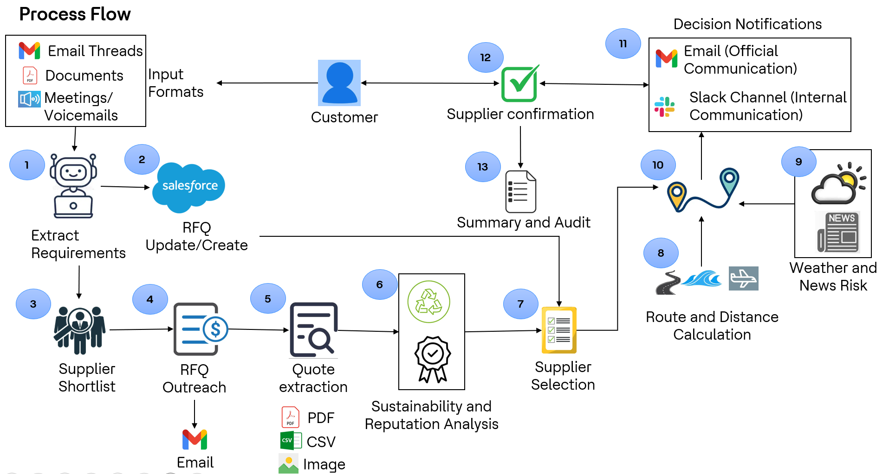

# GenAI SupplyChain Copilot
**RFQ → Supplier Selection → Negotiation → Logistics — fully agentic on Amazon Bedrock (Strands Agents + AgentCore).**

- GitHub: https://github.com/Bhuvaneshwari-0801/genai-supplychain-copilot.git 
- 🎥 Solution Demo: https://youtu.be/I6AxMIVICbw  
- 🏆 Built for: AWS Global Hackathon — https://aws-agent-hackathon.devpost.com

> This doesn’t replace your supply-chain stack — it **amplifies** it with GenAI.  
> The system normalizes messy supplier emails, scores quotes with explainable criteria, drafts counter-offers, plans logistics (cost/ETA/CO₂), and logs an auditable trail.


---

## Why this matters
Procurement starts in messy places (email/PDF/CSV). Decisions are slow, disruptions hit late, and costs spike. This copilot turns unstructured replies into structured RFQs, compares suppliers, negotiates, and proposes resilient routes — all while writing back to your systems and notifying stakeholders.

---

## Architecture at a glance


- **Strands Agents** coordinated by **Amazon Bedrock AgentCore**
- **Models (Bedrock)**:  
  - `amazon.nova-pro-v1:0` — Supervisor/Orchestrator  
  - `anthropic.claude-3-5-haiku-20241022-v1:0` — Email/RFQ extraction & outreach  
  - `anthropic.claude-3-5-sonnet-20241022-v2:0` — Evaluation, negotiation, logistics

**Key integrations:** Salesforce, DynamoDB, SES, Slack, Gmail, S3/Textract, Mapbox, Open-Meteo, Tavily, Wikipedia, Folium (map).

---

## Agents (0–5) + Supervisor (6)
| Agent | Purpose (one-liner) |
|---|---|
| **A0 – Email Intelligence** | Fetch supplier emails (Gmail) and extract structured RFQ data (SKUs, qty, price, terms). |
| **A1 – RFQ Update** | Validate & upsert RFQs in Salesforce; standardize entries in DynamoDB. |
| **A2 – Supplier Selection** | Score suppliers on cost/delivery/quality/sustainability; shortlist for progression. |
| **A3 – Quotation Normalization & Analysis** | Normalize quotes into comparable schema; benchmark with market/wiki signals. |
| **A4 – Negotiation & Communication** | Draft optimized counter-offers/emails/Slack with sentiment cues. |
| **A5 – Logistics & Routing Optimization** | Compute ocean vs split air+ocean, cost/ETA/CO₂; lane risk via news/weather. |
| **A6 – Supervisor / Orchestrator** | Plans, triggers, and monitors all agents; handles data hand-offs, retries, and summary. |

---

## Process flow


1. Buyer creates RFQ in Salesforce → suppliers receive emails.  
2. Replies arrive (email/PDF/CSV) → normalized `{unit_price, currency, lead_time_days, incoterms, valid_till, notes}`.  
3. Quotes are scored; counter-offer/award drafted.  
4. Logistics plan proposes mode and route with risk cues; summary + audit written back.  
5. Light Slack notifications at key steps.

---

## How this complements **AWS Supply Chain**
- **Side-car to ASC**: We handle the **tactical sourcing loop** (RFQ→award→routing). Cleaned outputs (RFQ facts, scored quotes, awards, shipment options) can land in **S3** and be mapped into the **ASC Data Lake** for planning/visibility.  
- **Closed loop**: ASC risk and order-tracking insights can feed back into our Supervisor to time negotiations or switch routing (e.g., split air+ocean).  
- **N-Tier collaboration**: After award, partners can use **ASC N-Tier Visibility** for PO/forecast/status while our agents continue supplier comms (email/Slack).  
- **Resilience**: ASC drives network resiliency; we add **operational resilience** with disruption sensing (news/weather) and explainable choices.

---

---
## Overview Deck
[Download the overview (PDF)](docs/deck/overview.pdf)

<p align="center">
  <a href="docs/deck/overview.pdf">
    
  </a>
  <br><em>Open the full deck (PDF)</em>
</p>
---

## Highlights
- **Inbox → Award, end-to-end** with explainable scoring and **audit trail** (Salesforce + DynamoDB).  
- **Risk-aware routing** with news & weather checks and a shareable **interactive map**.  
- **Human-readable outputs** (emails/Slack) + one-click summary for leadership.  
- **Secure by default**: `.env.example` + `test_env_setup.py` validate configuration (no secrets in Git).

---

## Quickstart

### 1) Install
```bash
python -m venv .venv && source .venv/bin/activate
pip install -r requirements.txt
cp .env.example .env   # fill in your keys/tokens
python test_env_setup.py
```

### 2) Local runtime (AgentCore entrypoint)
```bash
LOCAL_TEST=1 python master-agent-runtime-entrypoint.py
```

### 3) Full orchestrator (demo)
```bash
python supply-chain-master-agent.py
```

> Models & regions are configured via env; see `config.py` (and `requirements.txt` for deps).

---

## Repo map (high level)
- `supply-chain-master-agent.py` — Orchestrator + all agents/tools  
- `master-agent-runtime-entrypoint.py` — AgentCore Runtime entrypoint  
- `route_mapper.py` — Mapbox/Folium route visualization  
- `requirements.txt` — Dependencies  
- `test_env_setup.py` — Environment validation  
- `docs/images/…` — Diagrams (agentic-workflow.png, tech-architecture.png, process-flow.png)

---

## Roadmap (high level)
- **Kiro** & **Amazon Q** front-ends  
- Guardrails + RAG over SOPs/POs  
- Predictive disruption engine; Nova Act for autonomous actions  
- Deeper ASC data-lake mapping

---

## Links
- **AgentCore Runtime** quickstart: see `REFERENCES.md`  
- **Strands Agents** docs: see `REFERENCES.md`  
- **Hackathon**: https://aws-agent-hackathon.devpost.com
